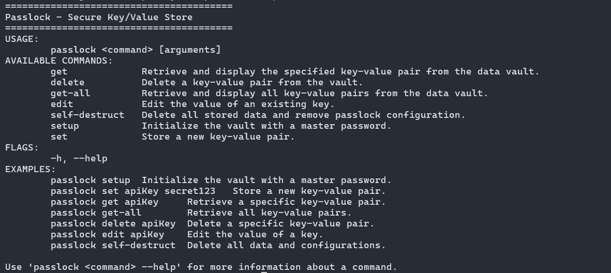

# Passlock

Users may safely save, manage, and retrieve their passwords with Pass-Lock, a command-line interface (CLI) key-value storing manager. It uses AES encryption to safeguard private information, guaranteeing security and privacy. This project prioritizes usability without sacrificing security and exemplifies excellent practices for encryption.



## Project Structure

- `cli`: Contains the function `Setup` to initialize the CLI.
- `cmd`: Contains the commands like `delete`, `edit`, `setup`, and `get`.
- `helpers`: Contains the helper functions used within the project like `DeriveKey`, `Encrypt`, `ReadPassword`, and `ValidateInput`.
- `types`: Contains the data types `Command`, `CommandDistance`, and `PlockEntry`.
- `main.go`: Main entry file.

## Requirements

Make sure you have the following installed:
- Golang (Go): [Installation Guide](https://go.dev/doc/install)

## Installation

1. Clone the repository:
    ```bash
    git clone https://github.com/Ege-Okyay/passlock.git
    ```
2. Navigate to the project directory:
    ```bash
    cd passlock
    ```
3. Install dependencies: No external libraries are required. Ensure Go is installed and properly configured.
4. Build the application
    ```bash
    go build
    ```
5. Run the application:
    ```bash
    ./passlock
    ```

## Usage

1. Initialize the vault with a master password:
    ```bash
    ./passlock setup
    ```
    - Prompts for a master password and encrypts it for future use.

2. Store a new key-value pair:
    ```bash
    ./passlock set <key> <value>
    ```
    - Example: `./passlock set apiKey "secret123"`

3.  Retrieve and display the specified key-value pair from the data vault:
    ```bash
    ./passlock get <key>
    ```
    - Example: `./passlock get apiKey`

4. Retrieve and display all key-value pairs from the data vault:
    ```bash
    ./passlock get-all
    ```

5. Edit the value of an existing key.:
    ```bash
    ./passlock edit <key>
    ```
    - Example: `./passlock edit apikey`

6. Delete a key-value pair from the vault:
    ```bash
    ./passlock delete <key>
    ```
    - Example: `./passlock delete apiKey`

7.  Delete all stored data and remove passlock configuration:
    ```bash
    ./passlock self-destruct
    ```

## Encryption Details

- **AES Encryption**:
    - AES is used to encrypt and decrypt the master password and data entries. The encryption key is derived from the master password using a key derivation function.

- **Storage Files**:
    - `keys.plock`: Stores the encrypted master password and AES key.
    - `data.plock`: Stores encrypted user data entries as key-value pairs.

- **Cross-Platform Storage**:
    - The data is saved in platform-specific directories (e.g., `APPDATA` for Windows, `~/Library` for macOS).

## Project Report

For a detailed explanation of the encryption strategies used in this project, check out the **project report**: [Work in progress](https://egeokyay.xyz)

## Video Explanation

Watch the video walkthrough of the project to understand how it works: [Work in progress](https://egeokyay.xyz)

## Contributing

Contributions are welcome! Feel free to open an issue or submit a pull request if you have ideas for improvements or find any bugs.

1. Fork the repository
2. Create a new branch (`git checkout -b feature-branch`)
3. Commit your changes (`git commit -m "Add feature"`)
4. Push to the branch (`git push origin feature-branch`)
5. Open a Pull Request
